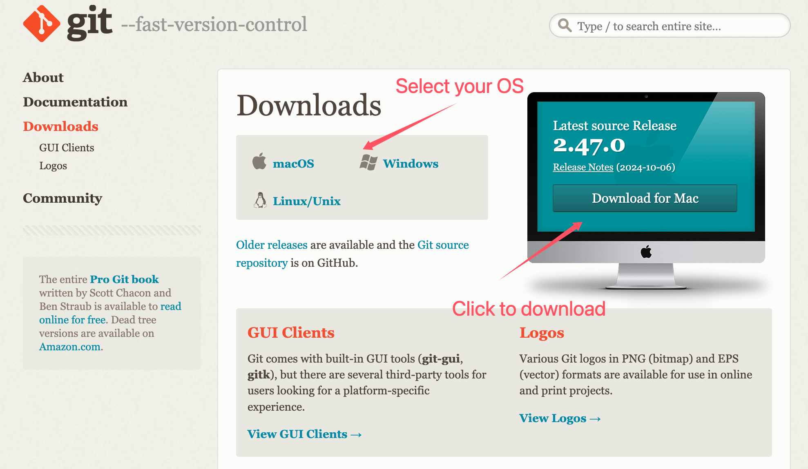
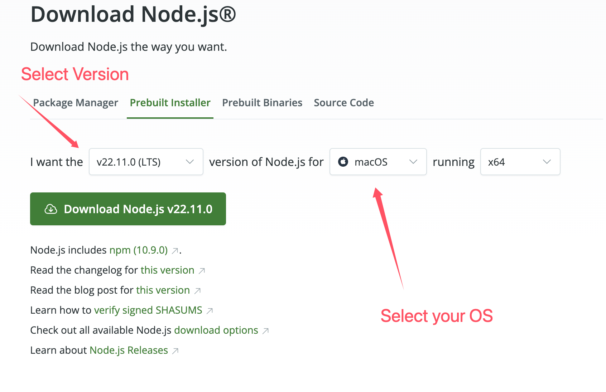

# Personal Blog establish by GitHub&Hexo I:Install Git&Node
[*Git*](https://git-scm.com/) and [*Node*](https://nodejs.org/en) are necessary requirements for the environment before setting up your own blog.

## Step1: Install Git
1.Open  [offical website of Git downloads](https://git-scm.com/downloads), the download page may show as this:



2.Download the version that fits your OS.(If your operation system is windows10 or higher, download git for windows.)

3.Install Git.

4.Check the Installment

5.Here are some bashes you may use in the future, the bashes here aim to config your account for git.

```bash
git config --global user.name "Your Name"
git config --global user.email "email@example.com"
# for example：
# git config --global user.name "Mis"
# git config --global user.email "Mis@gmail.com"

```
## Step2: Install Node
1.[Download Node.js](https://nodejs.org/en), the download page may show as this:



2.Install Node.js.

3.Check the Installment of Node.js & npm

Open CMD and then input：

```bash
node -v

```
to check version of Node.js.

Input :

```bash
npm -v
```
to check version of npm.

If it returns v20.18.0(your Node.js version), that means Node.js has been installed successfully.

If it returns 10.8.2(your npm version),that means npm has been installed successfully.

## Once requirements have been installed, it's time to starting your own blog
[Personal Blog establish by GitHub&Hexo II: Github ]()


