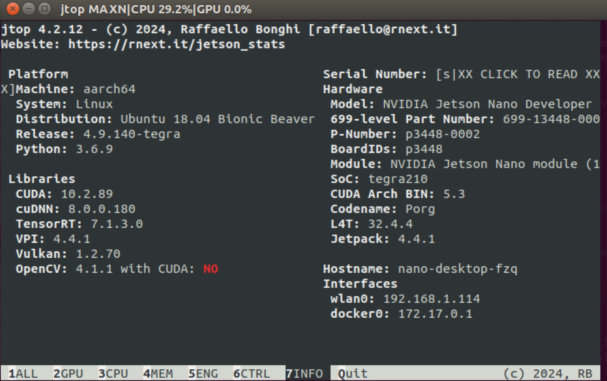
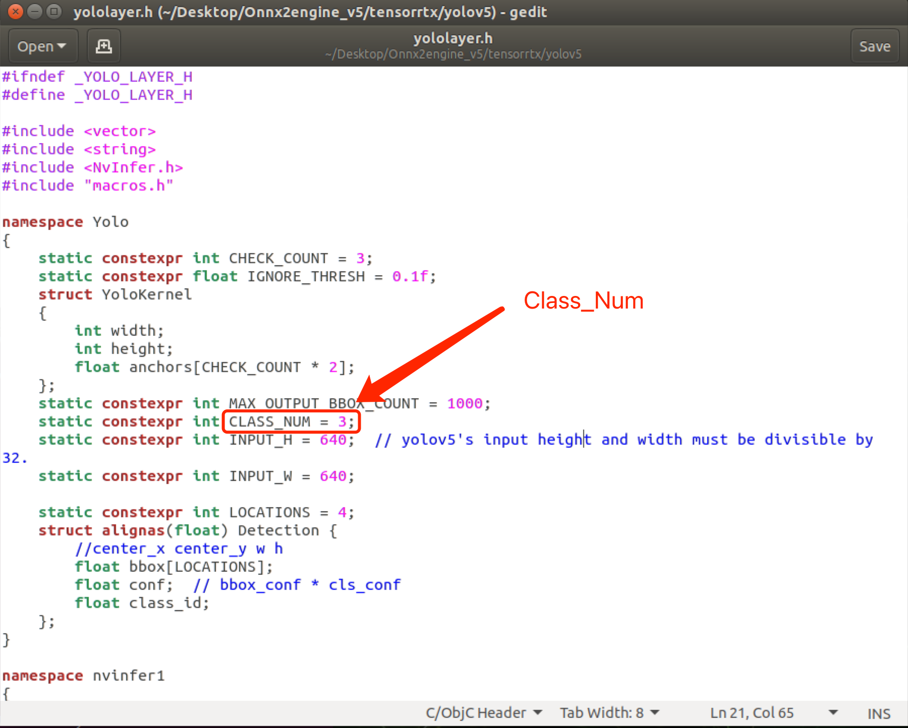
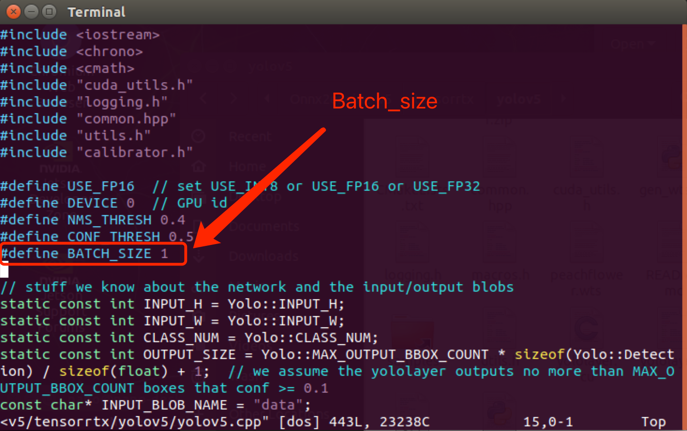
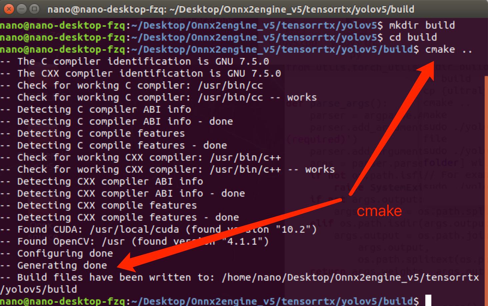
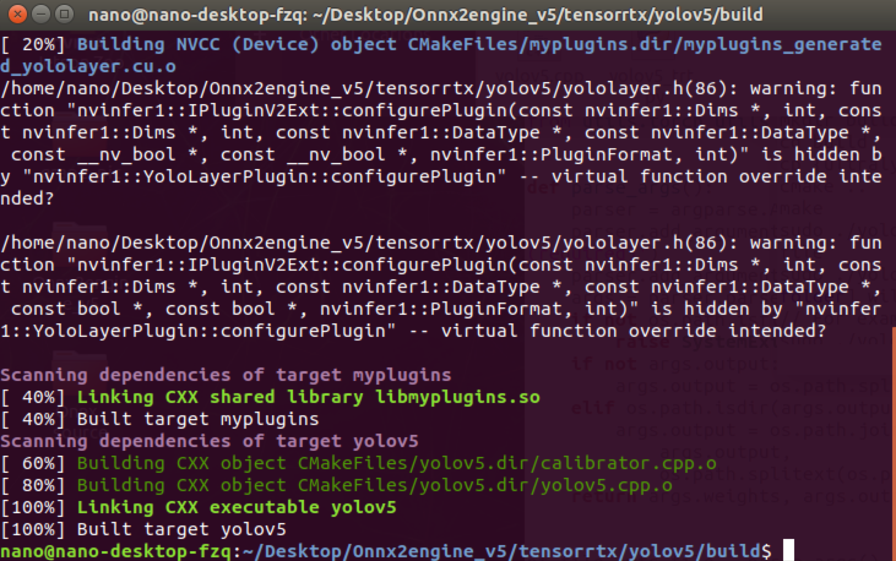
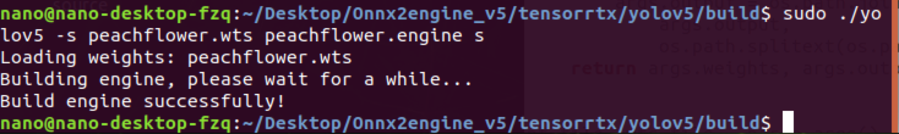

# Converting YOLOv5-5.0 Models to TensorRT Engine on Jetson Nano: Complete Guide with Error Handling

## Overview

This guide provides instructions for converting YOLOv5 PyTorch (.pt) models to TensorRT engine (.engine) files on Jetson Nano devices. 

Special attention is given to version compatibility (specifically YOLOv5-v5.0) and troubleshooting common conversion errors.

### Key Concepts

- **.pt**: PyTorch weights file from model training
- **.wts**: Intermediate weights file containing network architecture
- **.engine**: TensorRT-accelerated inference file

## 1. Prerequisites

### 1.1 Hardware & System Requirements

- Jetson Nano Developer Kit
- JetPack SDK 4.4+ (Verified via `jtop` monitoring tool)
  

### 1.2 Model Preparation

- **Option 1**: Custom-trained YOLOv5-v5.0 .pt file

- **Option 2**: Official YOLOv5s model (v5.0):

```bash
wget https://github.com/ultralytics/yolov5/releases/download/v5.0/yolov5s.pt
```

### 1.3 Repository Setup

```bash
# Clone official YOLOv5 (v5.0)
git clone -b v5.0 https://github.com/ultralytics/yolov5.git

# Clone TensorRTX conversion tools (v5.0 compatible)
git clone -b yolov5-v5.0 https://github.com/wang-xinyu/tensorrtx.git
```

-----

## 2. Conversion Workflow

### 2.1 Generate .wts File

1. Copy the conversion script:

```bash
cp [your path to tensorrtx]/yolov5/gen_wts.py [your path to ultralytics]/yolov5/
```

2. Execute conversion:

```bash
cd yolov5
python gen_wts.py -w your_model.pt -o converted.wts
```

### 2.2 Configure Model Parameters

**Critical parameters** (Edit before compilation):

1. **CLASS_NUM**: `tensorrtx/yolov5/yololayer.h`
   
2. **Batch Size**: `tensorrtx/yolov5/yolov5.cpp`
   

### 2.3 Build TensorRT Engine

```bash
mkdir build && cd build
cmake ..
make
sudo ./yolov5 -s ../converted.wts engine.engine s
```
**Build Process of cmake**



**Build Process of make**



**Build Process of coverting**



### 2.4 Inference Test

```bash
./yolov5_det -d engine.engine ../images
```

Check the `build` directory for processed detection outputs.

------

## 3. Troubleshooting Common Errors

### 3.1 Network Architecture Mismatch

**Error Message:**

```bash
[E] [TRT] Parameter check failed at: 
../builder/Network.cpp::addScale::482, condition: shift.count > 0 ? 
(shift.values != nullptr) : (shift.values == nullptr)
yolov5_det: /home/nano/Desktop/Onnx2engine_v5/tensorrtx/yolov5/src/model.cpp:95: 
nvinfer1::IScaleLayer* addBatchNorm2d(nvinfer1::INetworkDefinition*, 
std::map<std::__cxx11::basic_string<char>, nvinfer1::Weights>&, 
nvinfer1::ITensor&, std::__cxx11::string, float): Assertion `scale_1' failed.
Aborted
```

**Solution:**
Ensure TensorRTX branch matches YOLOv5 version:

```bash
# Confirm compatible branches
git -C yolov5 checkout v5.0
git -C tensorrtx checkout yolov5-v5.0
```

### 3.2 Dependency Issues(Optional)

Install essential packages: 

```bash
sudo apt-get install libprotobuf-dev protobuf-compiler
```

------

## Version Compatibility Matrix

| Component |   Version   |                            Source                            |
| :-------: | :---------: | :----------------------------------------------------------: |
|  YOLOv5   |    v5.0     |  [Ultralytics Repo](https://github.com/ultralytics/yolov5)   |
| TensorRTX | yolov5-v5.0 | [TensorRTX Branch](https://github.com/wang-xinyu/tensorrtx/tree/yolov5-v5.0) |

------


