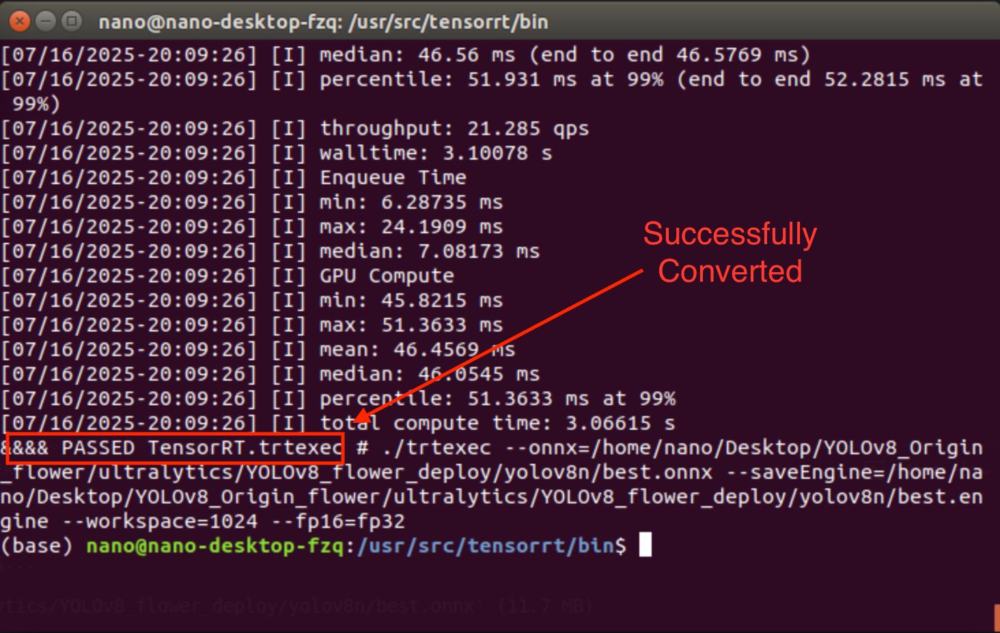
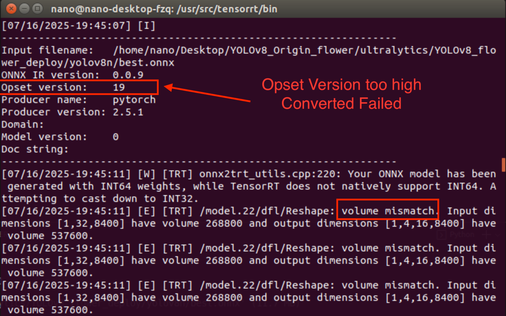
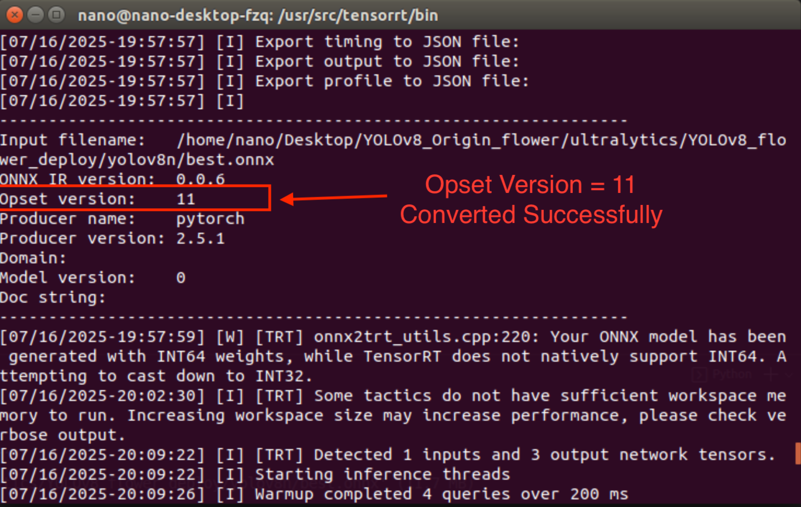

# Deploying YOLOv8 on Jetson Nano: Converting ONNX to TensorRT Engine and Troubleshooting Errors

## Introduction

In my previous article [*Converting YOLOv5-5.0 Models to TensorRT Engine on Jetson Nano:Complete Guide with Error Handling*](https://aurora-fang.github.io/2025/04/04/Yolov5-pt2engine-on-jetson-nano/), we discussed converting and deploying YOLOv5 models on Jetson Nano. This article focuses on the process of converting YOLOv8 models to TensorRT engine files on Jetson Nano and addresses common issues encountered during the process.

## Part 1: Generating the ONNX Model

### 1.1 Creating the ONNX Model

In your YOLO project environment, create a Python file with the following code to generate the ONNX model in the same directory as your .pt file:

```python
from ultralytics import YOLO
model = YOLO('ultralytics/YOLOv8_flower_deploy/yolov8n/best.pt')
model.export(format="onnx",opset=11,simplify=True)
```

**Technical Parameter Explanation**:

- `opset=11`: TensorRT on Jetson Nano supports ONNX opset versions 11-12 most stably
- `simplify=True`: Enables ONNX graph optimization, reducing ~15-30% of redundant nodes
- `dynamic=False`: Fixed input dimensions prevent dimension-related issues during TensorRT conversion

### 1.2 Converting ONNX to TensorRT Engine

Jetson Nano's JetPack includes the `trtexec` utility for ONNX-to-TensorRT conversion, located at:`/usr/src/tensorrt/bin/trtexec`

Navigate to this directory and execute the following command to convert your ONNX file to a TensorRT engine:

```BASH
./trtexec  --onnx=/home/nano/Desktop/YOLOv8_Origin_flower/ultralytics/YOLOv8_flower_deploy/yolov8n/best.onnx --saveEngine=/home/nano/Desktop/YOLOv8_Origin_flower/ultralytics/YOLOv8_flower_deploy/yolov8n/best.engine --workspace=1024 --fp16=fp32
```

**Technical Parameter Explanation**:

- `onnx`: Path to the input ONNX file
- `saveEngine`: Output path for the generated engine file
- `workspace`: Workspace size in MB (1024 recommended for YOLOv8n)
- `fp16=fp32`: FP16 quantization mode (32-bit)

A  conversion will generate the engine file at the  `saveEngine` path.



## Part 2: Common Conversion Issues

### 2.1 Dimension Mismatch Error




**Problems Analysis**:
By default, YOLOv8 exports models with opset version 19, but Jetson Nano's `trtexec` only supports opset versions 11-12, resulting in dimension mismatch errors.

**Solution**:
Explicitly set the opset parameter to 11 during YOLO export to match Jetson Nano's supported version.
The screenshot below shows a successful conversion with opset version 11:



This demonstrates how the opset version significantly impacts conversion success.

## Part 3: Summary and Best Practices

- **Problem Manifestation**: High opset versions (15+) cause TensorRT conversion failures with "unsupported operator version" or dimension mismatch errors

- **Root Cause**: TensorRT runtime on Jetson Nano has limited ONNX opset support (up to version 12)

- **Solution**: Explicitly specify `opset=11` or `opset=12` during ONNX export

- **Version Compatibility Table**:

  | TensorRT Version | Supported ONNX Opset Range |
  | :--------------: | :------------------------: |
  |   TensorRT 8.x   |            9-12            |
  |   TensorRT 7.x   |            9-11            |

- **Jetson Limitation**: TensorRT 8.0 included in JetPack 4.6 supports up to opset 12

- **Best Practices**:

  1. Always specify opset version during export
  2. Use ONNX simplifier for better compatibility
  3. Test conversions with different workspace sizes for optimal performance